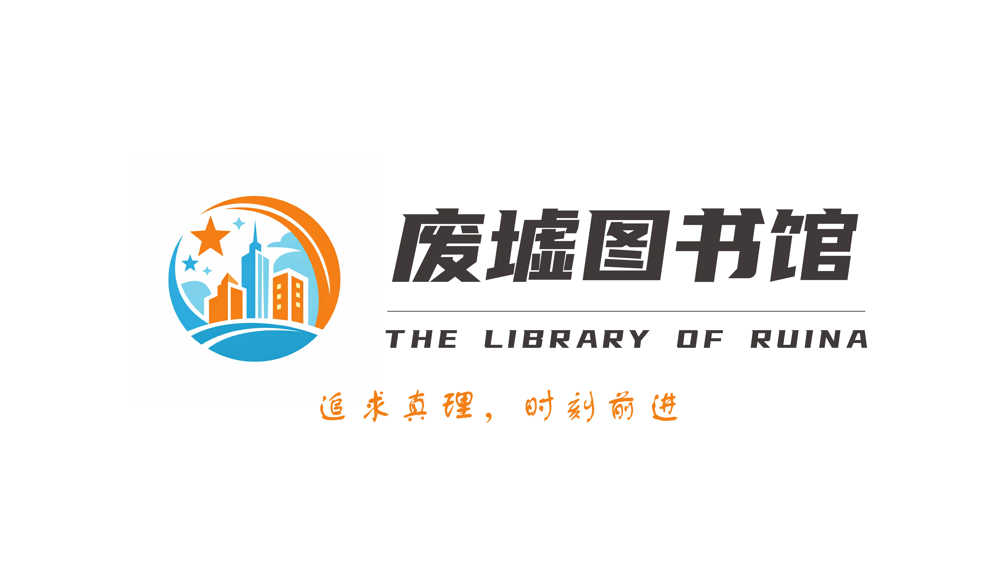

# 废墟图书馆

<iframe frameborder="no" border="0" marginwidth="0" marginheight="0" width=330 height=86 src="//music.163.com/outchain/player?type=2&id=2614175518&auto=1&height=66"></iframe>

 

> ***“废墟图书馆是服务器的重要社团之一，我们要坚持自身的发展道路和文化自信，同时吸收外来文化与有益建议，在沉淀中不断成长。”***  
> ——第二任、第四任馆长 Fengyuan24（九州）在第三次内部会议上的重要发言

> ***“沏一壶热茶，偎在壁炉旁，指尖翻开书页，也一同掀开了沉淀的历史。我想，这一刻，你才算真正回到了家。”***  
> ——常务副馆长 Starset_（川崎星夕）

***

## 在时光中沉淀的信仰

废墟图书馆的根源，藏着2016年友谊服务器“友谊小镇”的初心印记；其正式建制则定格于**2023年6月28日**——LemonDGP（柠檬）与limumujiu（水母）共同出任首任馆长，为社团按下了启程的按钮。

创立不久，时任副馆长Fengyuan24（九州）接任第二任馆长，以规范化建设为锚，带领社团迈入稳步发展的新阶段；2025年上旬，九州因个人原因卸任，禅位于迷迭香猫猫，任期内以休闲化运营为核心，让社团氛围更添松弛感；**2025年12月24日**，九州重返馆长岗位，创始人柠檬亦同期归队，二人携手为社团注入新的发展动能。

**2026年1月5日**，川崎星夕辞去璃虹港代理港长职务，正式加入废墟图书馆并出任常务副馆长。他将以丰富的管理经验、强烈的责任感与精益求精的履职态度，为社团的长远发展保驾护航。

## 社团介绍

**追求真理，时刻前进。**

废墟图书馆是一个以**共产、合作、协同、进步**为核心理念的Minecraft玩家社团，始终坚守“包容互惠、互利共赢、共同发展”的核心原则，在游戏中践行温暖互助的社群理想。

## 加入我们

无论你是想成为社团正式成员、入住社团辖区，还是作为外部社团伙伴、散人玩家寻求交流合作，都可通过官方QQ群与我们对接！

📮 废墟图书馆官方QQ群：[`389783397`](https://qm.qq.com/q/jrZdtuTaa4)

（群内无复杂审核，入群即享平等交流权限，期待与你相遇～）

## 自治社团支持

废墟图书馆秉持“自主自治、互助支持”的核心原则，不干涉合作自治社团的具体运营模式与发展规划，充分保障其独立性（如允许建立独立群聊），同时提供双重坚实保障：
- 安全保障：维护社团辖区正常秩序，快速处置恶意破坏等违规行为，为发展筑牢安全屏障；
- 资源支持：提供必要的物资补给与发展资源，助力合作社团开展建设、拓展特色活动。

欢迎各玩家团体咨询对接、申请合作加入！

## 结语

作为服务器历史悠久、底蕴深厚的老牌社团，废墟图书馆始终揣着一颗包容之心——我们接纳每一种类型的玩家，哪怕是曾有过失但愿意改正的伙伴，也愿以互助与理解，凝聚真正的社群力量。

**我们不止是游戏社团，更像一个温暖的小窝：这里承载着成员的回忆、故事与归属感，无论何时回头，都有你的专属位置。**

“最重要的，从来不是图书馆本身；最重要的，是组成图书馆的人。”

——现任馆长 Fengyuan24（九州）

**&copy; 2023-2026 废墟图书馆 版权所有**