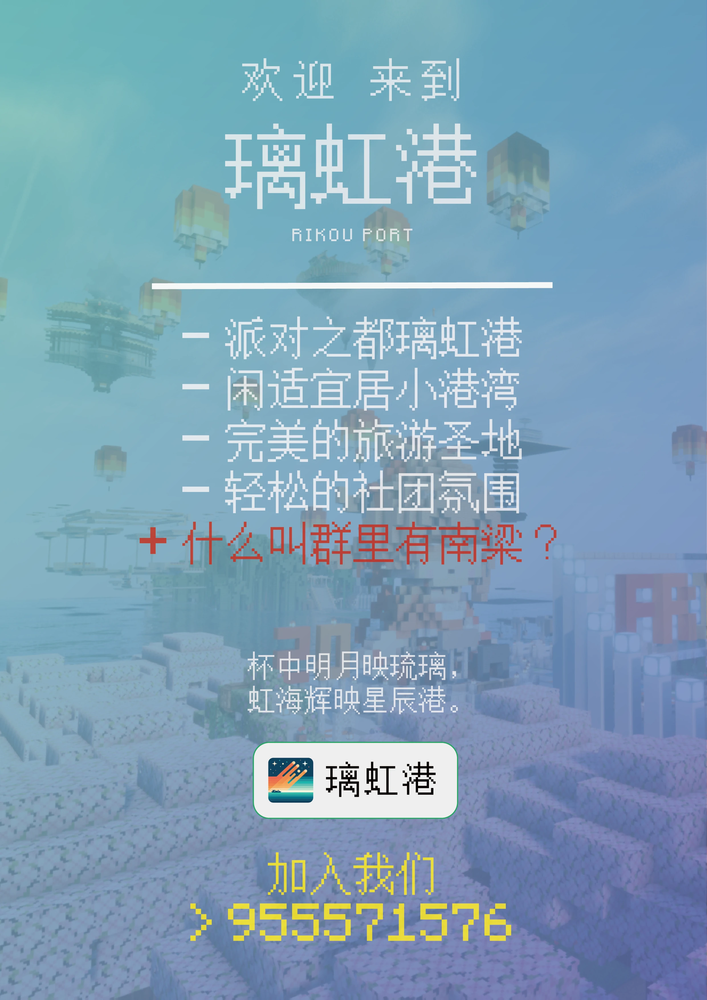

# 璃虹港 Riniji Port

<iframe frameborder="no" border="0" marginwidth="0" marginheight="0" width=330 height=86 src="//music.163.com/outchain/player?type=2&id=1492276426&auto=1&height=66"></iframe>

>  ***“杯中明月映琉璃，虹海辉映星辰港。”***

>  ***“琉璃光影，虹海万顷，灯火点缀的海港在繁星下闪烁，宛如一曲华丽的乐章。港口繁忙，细细品味杯中明月，环佩凭栏，展望千帆，远方的理想朦胧闪耀。众里寻他千百度，蓦然回首，璃虹却在，灯火阑珊处。这片港湾，如虹桥般，连接起每一位热爱闲暇的沧桑过客，承载着情谊与理想，而琉璃与虹海则是这片港湾的灵魂，闪耀着无尽的光辉，照亮前行的每一步。”***

>  *——璃虹港港长 川崎星夕Hoshiyuu*

---

 

***

## 港港的自我介绍~

### 初期状况

- 璃虹港成立于2024年4月14日，由**川崎星夕**和**九州**联合创立，是一个开放包容的Minecraft玩家社团。

- 尽管初期只有几名成员，但是在苏维埃社团的资助下，凭借坚定的信念和不懈的努力，大家成功建立了属于自己的社团，正式开启了它的史诗篇章。

### 进一步发展

- 随着时间的推移，璃虹港的成员数量不断增加，逐渐成为服务器中具有影响力的中型社团之一。

- 璃虹港取得了许多重要的成就和里程碑，为社区的繁荣作出了重要贡献。

### 现况

- 如今，璃虹港积极跻身大型社团行列，并积极参与各种活动。

- 璃虹港为其入驻服务器的多元化做出了重要贡献，未来将继续致力于创新和发展。

- “规范社团运行，促进服务器多元化交流，保障社团成员实现事半功倍的发展”是璃虹港的宗旨。

- 目前，从社团结构上，璃虹港由**璃虹七星议事厅**（高层议会）、**璃虹港市**（成员聚居地）、**璃虹港发展厅**（建筑、工业及农业发展部门）组成。

- 正所谓“七星护法，璃虹长存”，在各部门的宽领域深度合作下，璃虹港必将切实保障社团成员游玩积极性、社团可持续发展性和服务器多元性的有机统一。

- 璃虹港正努力通过服务器活动、大型建筑工程等方式，以创新驱动发展的理念，努力在服务器为小伙伴们创造一段不可磨灭的美好回忆。

- 璃虹港港长**川崎星夕**与璃虹港市长**程某人**将会继续带领璃虹港，实现长久辉煌的发展。

> [!TIP] 社团特征
> 璃虹港在众多社团中独树一帜的特点是开放性与包容性，其具体体现为，璃虹港有较多的男娘。
> 
> 目前，璃虹港已确认有9位男娘，而**川崎星夕**本人也是其中之一。

> [!WARNING] 璃虹港决不会让成员感受到高度政治化、强度化以及社团关系复杂化的压力。
> 尽管璃虹港目前制定了《璃虹港宪章》，建立了社团部门，但是这些都是促进社团可持续发展性所必要的。
> 
> 记住！璃虹港永远都是一座立足于Minecraft服务器的避风港！

***

## 展望未来

### 进入大型社团行列

- 璃虹港坚信自己一定能促进服务器多元化，并使得服务器变得更加精彩。

- 跻身大型社团决不是单方面宣布即可实现的，璃虹港必将经过大量建设，并与服务器积极互动，努力提升社团地位。

### 建设大型服务器建筑

- 川崎星夕是具有一定水平的现代风格建筑设计师，并有一定的工程领导经验。

- 在Friend友谊服务器，他曾领导建设了大型酒店、高速公路、中型图书馆等建筑，并且持有“孤云港”建设项目。

- 在下一周目，璃虹港将会筹划建设横跨几大社团的城际铁路，并在港口本土建设高铁站-航空综合枢纽，此枢纽将会是服务器的一项重大建设。

- 与此同时，璃虹港还将修建广场、酒店、商业街等建筑，以便服务以后的服务器派对活动。

***

## 加入璃虹港

想要加入我们？没有问题，你只需要在审核群聊内寻找机器人进行自助问卷填写即可，你的申请会在24小时内得到处理！

审核QQ群：[`483254523`](https://qm.qq.com/q/7cb7jTSusg)

> **“且于此港，徐行缓步，细品杯中明月，聆风拂柳，赏波光粼粼。身处虹海，静观云舒云卷，遥望千帆竞发。此间闲暇，与君共度，共绘宏图大志。琉璃之光辉，虹海之灿烂，长照心间，伴吾辈前行每一步，尽享无尽之美。”**

#### &copy; 2024 璃虹港