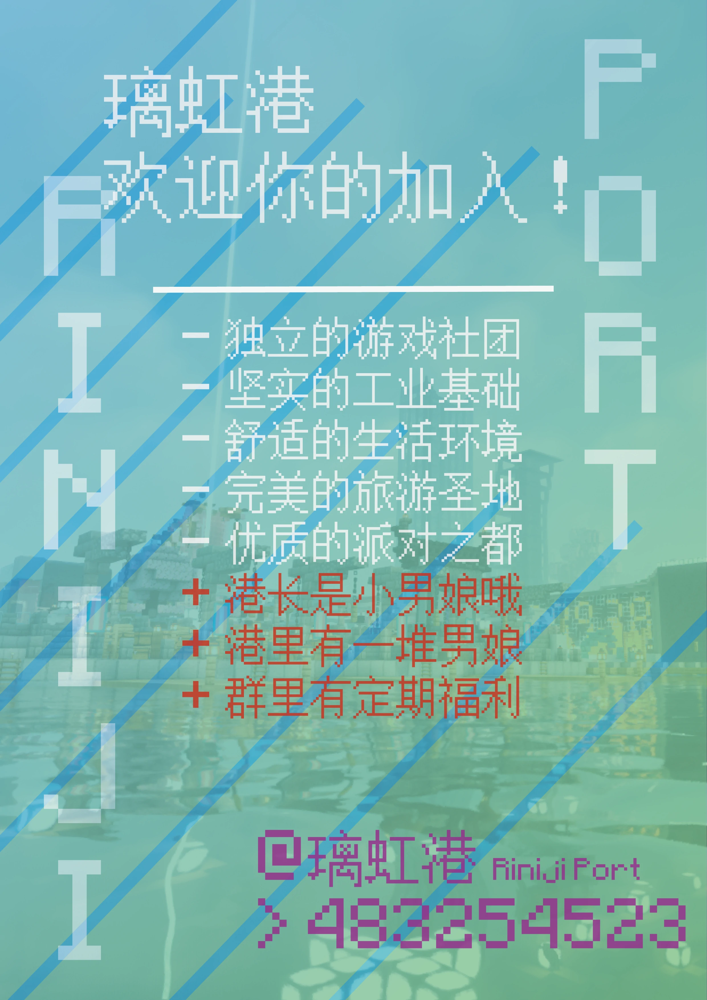

# 璃虹港 Riniji Port

>  ***“杯中明月映琉璃，虹海辉映星辰港。”***

>  ***“琉璃光影，虹海万顷，灯火点缀的海港在繁星下闪烁，宛如一曲华丽的乐章。港口繁忙，细细品味杯中明月，环佩凭栏，展望千帆，远方的理想朦胧闪耀。众里寻他千百度，蓦然回首，璃虹却在，灯火阑珊处。这片港湾，如虹桥般，连接起每一位热爱闲暇的沧桑过客，承载着情谊与理想，而琉璃与虹海则是这片港湾的灵魂，闪耀着无尽的光辉，照亮前行的每一步。”***

>  *——璃虹港港长 川崎星夕Hoshiyuu*

---

 

***

## 港港的自我介绍~

1. ### 初期状况

- 璃虹港成立于2024年4月14日，联合创始人是**川崎星夕**（璃虹港港长）和**九州**（璃虹港市长），是一个开放包容的Minecraft玩家团体。

- 尽管初期只有几名成员，在苏维埃公社的资助下，凭借坚定的信念和不懈的努力，大家成功建立了属于自己的团体，正式开启了它的史诗篇章。

2. ### 进一步发展

- 随着时间的推移，璃虹港的成员数量不断增加，逐渐成为服务器中具有影响力的中型团体之一。

- 璃虹港取得了许多重要的成就和里程碑，为社区的繁荣作出了重要贡献。

3. ### 现况

- 如今，璃虹港积极跻身大型团体行列，并积极参与各种活动。

- 璃虹港为其入驻服务器的多元化做出了重要的贡献，未来将继续致力于创新和发展。

- “规范团体运行，促进服务器多元化交流，保障团体成员实现事半功倍的发展”是璃虹港的宗旨。

- 目前，从团体结构上，璃虹港由**璃虹七星议事厅**（高层议会）、**璃虹港市**（成员聚居地）、**璃虹港发展厅**（建筑、工业及农业发展部门）部门组成。

- 正所谓“七星护法，璃虹长存”，在这些部门的宽领域深度合作下，璃虹港必将切实保障团体成员游玩积极性、团体可持续发展性和服务器多元性的有机统一。

- 璃虹港正努力通过服务器活动、大型建筑工程等方式，以创新驱动发展的理念，努力在服务器为小伙伴们创造一段不可磨灭的美好回忆。

> [!TIP] 团体特征  
> 璃虹港在众多团体中独树一帜的特点是开放性与包容性，其具体体现为，璃虹港有较多的男娘成员。  
> 目前，璃虹港已确认有5位男娘成员，而璃虹港港长**川崎星夕**本人也是其中之一。  
> 璃虹港具有较强的包容性。根据星夕所言：  
> “作为一名共青团员，我相信我们社会上的各种合法观念都趋向于受到尊重和包容。
> 在璃虹港，我们致力于创造一个开放、包容的环境，每个人都可以真实地表达自己。”

> [!WARNING] 璃虹港决不会让成员感受到高度政治化、强度化以及团体关系复杂化的压力。  
> 尽管璃虹港目前制定了《璃虹港宪章》，建立了团体部门，但是这些都是促进团体可持续发展性所必要的。  
> 记住！璃虹港永远都是一座立足于Minecraft服务器的避风港！

***

## 展望未来

1. ### 进入大型团体行列

- 璃虹港坚信自己一定能促进服务器多元化，并使得服务器变得更加精彩。

- 跻身大型团体决不是单方面宣布即可实现的，璃虹港必将经过大量建设，并与服务器积极互动，努力提升团体地位。

2. ### 与苏维埃公社达成战略合作

- 璃虹港生于苏维埃，星夕与九州也生于苏维埃，可以说，苏维埃与璃虹港有着深厚渊源。

- 在第七周目，璃虹港将与苏维埃优势互补，取长补短，努力建设互惠互利的联合团体。

3. ### 建设大型服务器建筑

- 川崎星夕是具有一定水平的现代风格建筑设计师，并有一定的工程领导经验。

- 在Friend友谊服务器，他曾领导建设了大型酒店、高速公路、中型图书馆等建筑，并且持有一个长期城建建设项目“孤云港”，可以在哔哩哔哩看到其建设实况。

- 在下一周目，璃虹港将会筹划建设横跨几大团体的城际铁路，并在港口本土建设高铁站-航空综合枢纽，此枢纽将会是服务器的一项重大建设。

***

## 加入璃虹港

审核QQ群：483254523

> **“且于此港，徐行缓步，细品杯中明月，聆风拂柳，赏波光粼粼。身处虹海，静观云舒云卷，遥望千帆竞发。此间闲暇，与君共度，共绘宏图大志。琉璃之光辉，虹海之灿烂，长照心间，伴吾辈前行每一步，尽享无尽之美。”**

#### &copy; 2024 璃虹港