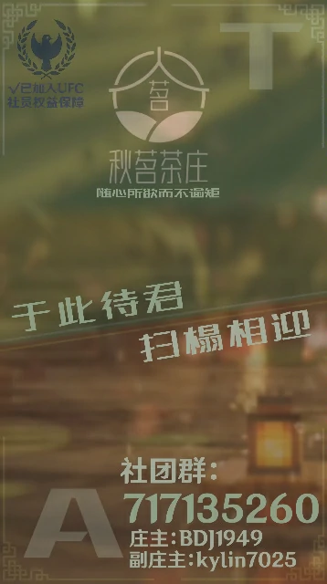

# 秋茗茶庄 Autumn＆Tea

> **“我于淡月卧秋茗，细品杯中不夜侯”**

> **“秋风拂面，茗香袭人，徽派建筑点缀的茶庄，好似一幅古典画卷，在Minecraft中静静绽放。茶香袅袅，细品佳茗，庭院回廊，凝望峨峨山水，远方之志趣在脑海中萦绕。寻遍虚拟间的千万砖，豁然开朗，秋茗乃在，梧飞之庭畔。茶庄如水墨画般，凝聚起每一位热爱Minecraft的游人，承载着友谊与智慧。欲以清茗与初心为精魂，闪烁恒久的庄严，共赴前程。”**

> *——秋茗茶庄庄主 本丞 BDJ1949*

## 茶庄简介

- 秋茗茶庄创立于2024年5月25日，联合创始人为**本丞**（秋茗茶庄庄主）和**麒麟**（秋茗茶庄副庄主）。在崎岖的发展之路上，我们吸引了许多玩家加入，茶庄也由两人之庄逐渐发展为广纳四方的中型社区。

- 我们创造了许多以徽派为首的建筑，以及各大生电装置辅助玩家，社区的公用仓库更是设计精妙。秋茗茶庄仍需壮大和发展，需要新的玩家、新的思路，成为一个有山有水、有景有画的大社区。

- 我们将继续结合建筑与生电，让生电融入建筑，建筑配合生电，使建筑更加壮观，生电更加发达，创造一个以“随心所欲而不逾矩”为理念的秋茗茶庄，让这里的玩家都能尽情放出自己的光芒！

## 现在加入

