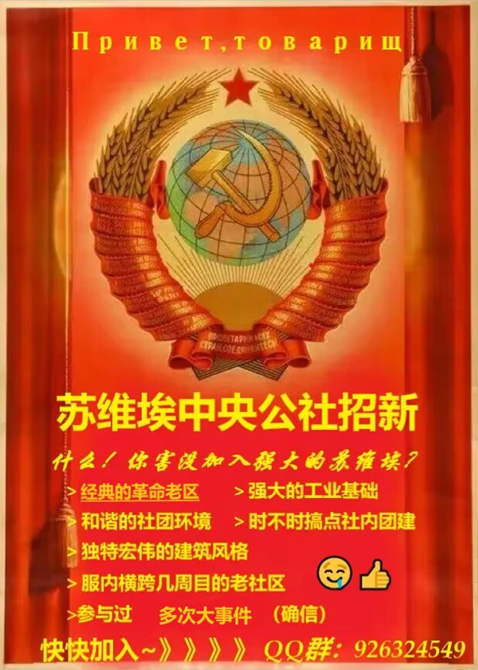

# 苏维埃中央公社
# Центральная советская коммуна

<iframe frameborder="no" border="0" marginwidth="0" marginheight="0" width=330 height=86 src="//music.163.com/outchain/player?type=2&id=4438153&auto=1&height=66"></iframe>

> ***“黎明之前的最后那段黑夜，往往是最漫长，最煎熬的。”***
> 
> ***“磅礴而又坚硬——苏维埃，而那颗宛如熊熊火焰般燃烧着的赤红艳阳，也有一个名字，人们习惯这样叫它，威武而又热情——布尔什维克，他们的出现无疑是给罪恶的资本迎头一棒，使得那些资本的代言人惊慌失措，闻风丧胆，可震慑不是最终目的，他们人人都有消灭资本的决心。”***
>
> *——苏维埃公社社长 Good_comrade233*

## 公社简介

- 苏维埃中央公社创立于2023年9月15日，由**Good_comrade233**和**xjri**在PaperCard纸片服务器联合创建。苏维埃由初期的小社团，一步步扩大为纸片服务器**第三大社团**，生电设施齐全。

### 发展

- 经过了[11月神权事件](#11月纸片神权事件)的风暴后，苏维埃社团不再有昔日的繁荣。

- 但是随着后面纸片服务器第一大社团——**极夜新星**社团的解体，苏维埃吸收了一些该社团的成员，以及之后的持续发展下，已经基本恢复到了事件之间的状态。

### 11月纸片神权事件

- 该事件是苏维埃社团衰落的开端。

- 苏维埃社团成员公开指责该管理不公正的行为：其管理为了包庇其好友做出了令人发指之事，踢出了相关事件成员。

- 并且，为了杜绝后患，他将苏维埃大部分其认为“不听话”的成员都悉数踢出。

- 一直到该管理与腐竹不和离开后，苏维埃一部分成员才回归社团。该事件对苏维埃的打击十分巨大。

### 解体风波

- ~~（未解密）~~**已解决**

### 宗旨

- 本社团主打一个团结有爱互帮互助，抵制一切不公正的行为！

### 现状

- 现在苏维埃已经脱离纸片服务器，正式搬迁至Friend-友谊服务器与璃虹港一同发展！

## 现在加入

