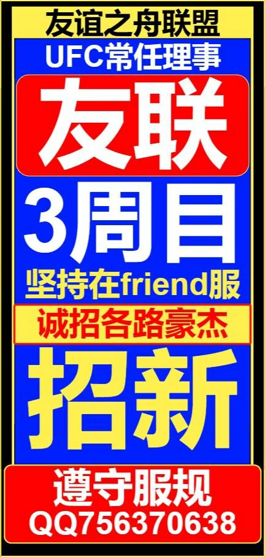

# 友谊之舟联盟 The Union of Friendship

>  ***“临高楼，登远山，形影不绰，惟有友人。”***

>  *——神圣羽毛帝国皇帝 chengyz*

---

## 联盟概况

### 伊始

- 友谊之舟联盟的前身是服务器1.19时期由现 [璃虹港](./LHG "男娘港")港长**川崎星夕** 领导的“共产基地” 和 [饭社](./FS "米哈游你服美食分享社")社长**构新** 领导的“共和组织”联合形成的“苏维埃人民公社联盟”。“苏维埃人民公社联盟”在1.19后期改组成立现==友谊之舟联盟==，吸引当时许多组织加入。大家围绕在*团结与友谊*的旗帜下，开启了联盟新的历史。

- 加盟组织名单(排名不分先后)：1.苏维埃人民公社联盟 2.夕阳红 3.烟雨楼 4.这镇 5.三三避难村。

- 友谊之舟联盟是带着任务诞生的，正如联盟那与服务器相呼应的名字。联盟的创立者希望友谊能在友谊服中长久存在，让每一位玩家体会到友谊的真谛。~~小马宝莉并感~~

### 历程

>***“忆往昔峥嵘岁月稠”***

- 联盟积极践行自己的理念，以各组织各玩家联合的力量，成为了服务器重要的组织。

- 联盟成功抵御了多次熊服事件，维护了许多玩家的正当利益，在服务器里享有广泛的声誉。

- 联盟倡议并与一些志同道合的组织共同创立了==友谊联合理事会==，是主要发起者和常任理事组织之一。

- 联盟成功举办了多次大型活动，例如1.19周目和1.20周目的$除夕祭$，给玩家们留下了美好的记忆。同时联盟的小伙伴们建设了众多机器和建筑，曾至多拥有11个基地，给了联盟强大的实力。

### 当下

- 联盟从1.19走来，到如今的1.21，已经是第三个周目了，是目前服务器里历史最悠久的组织。

- 联盟会继续秉持“友谊第一”的原则，努力创造友好游玩的环境，为大家带来更多美好记忆。

- 目前，联盟由**友谊之舟联盟中央议会**、**友谊之舟联盟中央行政部门**、**海参崴**（新人组织）组成；联盟的领导组织是**联盟议会长cutil**、**联盟副议会长PJYLLL**、**联盟总理XuanRikka**。~~其实还有神圣羽毛帝国皇帝chengyz~~

- ==友谊之舟联盟== 已与 [璃虹港](./LHG "我说过，这就是南梁") 达成长期合作并建立**璃珠港特区**（联盟首都）。

> [!WARNING] 联盟是一个自由的组织，欢迎任何遵守服务器规则、文明友好的玩家加入。无论你是生电玩家、肝帝、建筑师、养老玩家还是PVP大佬，都能一起来愉快van耍！
> 我们努力使玩家放心游戏，而不是处理各种虚幻的关系！

***

## About Future?

1.**你们**是联盟的未来，是友谊的未来。

2.联盟会及时制定发展规划，发展自身；并继续在本周目举行各种活动。

3.联盟将定期开展**议会**，规划联盟事宜，每个人都可以提出自己的意见和规划！

***

## 联盟招新

**如何加入联盟**

1.加入审核QQ群：756370638

2.学习遵守[FRIEND-友谊服务器玩家公约](/rule "老大严选")，友好游玩

3.审核通过，正式加入联盟

> [!TIP]不必担心，只要遵守规则，友好文明，审核很快就会通过的，正如前面所说，联盟是一个自由的组织！只要好好玩就好啦！

审核QQ群：

> **“光阴易逝，友谊长存！”**

#### &copy; 2024.07.08 友谊之舟联盟
*Edited by chengyz no rights reserved*

***
## 注释&引用
> 本文所有历史数据和记载均选自或根据《友谊之舟联盟1.20通史》川崎星夕 著；友谊之舟联盟中央出版社。
> 
> 本文所有有关联盟体系和规则的内容均根据《友谊之舟联盟成员公约》《友谊之舟联盟成员转正规章（试行版）》《友谊之舟联盟1.21临时议会大纲》；友谊之舟联盟中央出版社。
**为维持文章简洁便于阅读，所有引用注释均不特别标出，统一于文章末尾写明，感谢你的浏览**